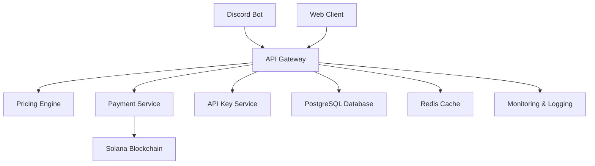

# 🚀 Ilyrium Dynamic Pricing System

[](https://nestjs.com/)
[](https://www.typescriptlang.org/)
[](https://nodejs.org/)
[](https://postgresql.org/)
[](https://redis.io/)
[](https://solana.com/)

> **Enterprise-grade Dynamic Pricing API** with real-time blockchain payment processing, Discord bot integration, and sophisticated pricing algorithms for RPC services.

## 🎯 **Overview**

The Ilyrium Dynamic Pricing System is a **production-ready, enterprise-grade** API that implements sophisticated dynamic pricing for blockchain RPC services. Built with **NestJS** and **TypeScript**, it features real-time pricing algorithms, Solana blockchain integration, Discord bot automation, and comprehensive security measures.

### 🏆 **Key Highlights**

- **🎯 Dynamic Pricing Engine** - Real-time utilization-based pricing
- **💰 Solana Blockchain Integration** - Automated payment processing
- **🤖 Discord Bot Integration** - Interactive purchase flows & subscription management
- **🔐 Enterprise Security** - API keys, rate limiting, encryption
- **📊 Advanced Analytics** - Usage tracking and performance monitoring
- **⚡ High Performance** - Redis caching, connection pooling, optimization
- **📋 Subscription Management** - Secure API key regeneration & subscription viewing

---

## 🚀 **Architecture Overview**

### **System Components**



### **Core Modules**

| Module          | Purpose                | Key Features                                              |
| --------------- | ---------------------- | --------------------------------------------------------- |
| **Pricing**     | Dynamic pricing engine | Real-time calculations, tier management                   |
| **Payment**     | Blockchain payments    | Solana integration, transaction monitoring                |
| **Discord Bot** | User interaction       | Purchase flows, subscription management, key regeneration |
| **API Key**     | Authentication         | Secure key management, regeneration, validation           |
| **RPC**         | Request proxying       | Rate limiting, usage tracking                             |

---

## 🎯 **Key Features**

### **🎯 Dynamic Pricing Engine**

- **Real-time price calculation** based on system utilization
- **Configurable price ranges** (min/max) and total capacity
- **Automatic price adjustment** as demand changes
- **Transparent pricing model** for users

**Pricing Algorithm:**

```
Current Utilization = Used RPS / Total Available RPS
Price Multiplier = 1 + (Current Utilization × 4)
Final Price = Base Price × Price Multiplier
```

### **💰 Tiered Subscription System**

| Tier      | RPS | Use Case              | Price Range      |
| --------- | --- | --------------------- | ---------------- |
| **Basic** | 10  | Development & Testing | $0.001 - $0.01   |
| **Ultra** | 25  | Production Apps       | $0.0025 - $0.025 |
| **Elite** | 50  | High-volume Workloads | $0.005 - $0.05   |

### **🔗 Solana Blockchain Integration**

- **Unique payment addresses** for each transaction
- **Automated transaction monitoring** with confirmation tracking
- **Fund sweeping** to main wallet (hourly cron job)
- **USDC and SOL support** with configurable tokens
- **Encrypted private key storage** for security

### **🤖 Discord Bot Integration**

- **Interactive purchase flows** with button-based UI
- **Real-time notifications** for payment status
- **User management** with Discord profile sync
- **Ephemeral messaging** for security
- **Automated API key delivery** upon purchase completion
- **📋 Subscription Management** - View active subscriptions and API keys
- **🔄 Secure Key Regeneration** - Regenerate API keys with confirmation
- **🔐 Security-First Design** - Industry-standard key management

### **🔐 Enterprise Security**

- **API Key Authentication** with bcrypt hashing
- **Rate Limiting** with Redis-based throttling
- **Request/Response Logging** with correlation IDs
- **Input Validation** with class-validator decorators
- **Security Headers** with Helmet middleware
- **Encrypted Data Storage** for sensitive information
- **Secure Key Regeneration** - Industry-standard key management with confirmation
- **Separation of Concerns** - Key management isolated from pricing calculations

### **📊 Advanced Analytics**

- **Real-time usage monitoring** per wallet address
- **Historical usage data** with 30-day retention
- **Performance metrics** with Application Insights
- **Business intelligence** with custom dashboards
- **Audit trails** for compliance and debugging

---

## 🛠️ **Technology Stack**

### **Core Framework**

- **NestJS 10.4.4** - Progressive Node.js framework
- **TypeScript 5.6.2** - Type-safe JavaScript with strict mode
- **Node.js ≥24.6.0** - JavaScript runtime

### **Database & Caching**

- **PostgreSQL** - Primary database with TypeORM
- **Redis** - Caching and rate limiting
- **TypeORM 0.3.20** - ORM with migrations support

### **Blockchain & Payments**

- **Solana Web3.js** - Blockchain integration
- **@solana/spl-token** - Token operations
- **Unique payment addresses** - Per-transaction addresses

### **Security & Validation**

- **Helmet** - Security headers
- **CORS** - Cross-origin resource sharing
- **bcryptjs** - Password hashing
- **Class-validator** - DTO validation
- **Rate Limiting** - Redis-based throttling

### **Monitoring & Logging**

- **Application Insights** - Azure monitoring
- **Custom Loggers** - Structured logging
- **Performance Tracking** - Metrics and analytics

### **Development Tools**

- **ESLint** - Code linting with custom rules
- **Prettier** - Code formatting
- **Husky** - Git hooks
- **Lint-staged** - Pre-commit linting

---

## 📁 **Project Structure**

```
├── src/
│   ├── main.ts                    # Application bootstrap
│   ├── app.module.ts              # Root module
│   ├── app.controller.ts          # Health check endpoints
│   ├── app.service.ts             # Core application service
│   ├── common/                    # Shared utilities
│   │   ├── services/              # AppLogger, ConsoleLogger, AppCacheService
│   │   ├── guards/                # Rate limiting, authentication guards
│   │   ├── middleware/            # Request logging, API key middleware
│   │   ├── filters/               # Global exception handling
│   │   └── utils/                 # HTTP utilities, crypto helpers
│   ├── config/                    # Configuration modules
│   │   ├── app.config.ts          # Application settings
│   │   ├── database.config.ts     # PostgreSQL configuration
│   │   ├── redis.config.ts        # Redis configuration
│   │   ├── solana.config.ts       # Blockchain settings
│   │   └── discord.config.ts      # Bot configuration
│   └── modules/                   # Business logic modules
│       ├── pricing/               # Dynamic pricing engine
│       │   ├── services/          # PricingEngineService, PurchaseService
│       │   ├── controllers/       # API endpoints
│       │   └── entities/          # Database models
│       ├── payment/               # Blockchain payment processing
│       │   ├── services/          # PaymentService, SolanaService
│       │   ├── services/          # TransactionMonitorService, PaymentSweepService
│       │   └── entities/          # PaymentAttempt, PaymentTransaction
│       ├── discord-bot/           # Discord integration
│       │   ├── services/          # DiscordBotService, DiscordUserService
│       │   ├── services/          # PurchaseService, DiscordNotificationService
│       │   └── entities/          # DiscordUser
│       ├── api-key/               # Authentication & authorization
│       │   ├── services/          # ApiKeyService
│       │   ├── middleware/         # ApiKeyMiddleware
│       │   └── entities/          # ApiKey
│       └── rpc/                    # RPC proxy and rate limiting
├── migrations/                     # Database migrations
├── eslint-rules/                  # Custom ESLint rules
├── dist/                          # Compiled JavaScript
└── node_modules/                  # Dependencies
```

---

## 🚀 **Quick Start**

### **Prerequisites**

- **Node.js ≥24.6.0**
- **PostgreSQL ≥13.0**
- **Redis ≥6.0**
- **npm ≥10.0.0**

### **Installation**

```bash
# Clone the repository
git clone https://github.com/your-org/ilyrium-dynamic-pricing.git
cd ilyrium-dynamic-pricing

# Install dependencies
npm install

# Copy environment configuration
cp .env.example .env

# Configure your environment variables
nano .env
```

### **Environment Configuration**

```bash
# Database Configuration
DB_HOST=localhost
DB_PORT=5432
DB_USERNAME=your_username
DB_PASSWORD=your_password
DB_NAME=ilyrium_pricing

# Redis Configuration
REDIS_HOST=localhost
REDIS_PORT=6379
REDIS_PASSWORD=your_redis_password

# Solana Configuration
SOLANA_RPC_URL=https://api.mainnet-beta.solana.com
SOLANA_PAYMENT_WALLET=your_wallet_address
SOLANA_USDC_MINT=EPjFWdd5AufqSSqeM2qN1xzybapC8G4wEGGkZwyTDt1v

# Discord Bot Configuration
DISCORD_BOT_TOKEN=your_bot_token
DISCORD_CLIENT_ID=your_client_id
DISCORD_GUILD_ID=your_guild_id

# Application Configuration
NODE_ENV=development
PORT=3000
JWT_SECRET=your_jwt_secret

# Production Configuration (set these for production)
RPC_BACKEND_URL=http://your-production-domain.com/api/rpc
DEFAULT_HOST=your-production-domain.com
DEFAULT_PORT=3000
```

### **Database Setup**

```bash
# Run database migrations
npm run db:migration:run

# Verify database connection
npm run start:dev
```

### **Development**

```bash
# Start development server with hot reload
npm run start:dev

# Start with debugging
npm run start:debug

# Build for production
npm run build

# Start production server
npm run start:prod
```

---

## 📚 **API Documentation**

### **Core Endpoints**

#### **Health Check**

```http
GET /health
```

Returns system health status, database connectivity, and Redis status.

#### **Pricing Information**

```http
GET /api/pricing/tiers
```

Returns available pricing tiers with current dynamic prices.

**Response:**

```json
[
  {
    "name": "Basic",
    "rps": 10,
    "price": 0.005,
    "description": "Perfect for development and testing"
  }
]
```

#### **Purchase Management**

```http
POST /api/purchase/buy-tier
Content-Type: application/json
x-api-key: your-api-key

{
  "walletAddress": "DYw8jCTfwHNRJhhmFcbXvVDTqWMEVFgXz",
  "tier": "Basic",
  "duration": 30
}
```

#### **Usage Tracking**

```http
GET /api/usage?walletAddress={address}
x-api-key: your-api-key
```

Returns usage metrics, allocation details, and recent activity.

### **Discord Bot Commands**

- **`/rpc-services`** - View available pricing tiers
- **Interactive buttons** - Purchase tiers directly
- **Real-time notifications** - Payment status updates
- **API key delivery** - Automatic key generation
- **📋 View My Active Subscriptions** - See all active purchases and API keys
- **🔄 Regenerate API Keys** - Secure key regeneration with confirmation
- **🔐 Security Features** - Industry-standard key management

### **📋 Subscription Management Features**

The Discord bot provides comprehensive subscription management with enterprise-grade security:

#### **View Active Subscriptions**

- **Rich Discord Embeds** - Beautiful, organized display of all active subscriptions
- **Purchase Details** - Tier, RPS allocation, price, expiration dates
- **API Key Overview** - Masked keys with names and usage information
- **Backend URL** - Easy access to your RPC endpoint

#### **Secure API Key Regeneration**

- **Industry Standard** - Follows security practices used by GitHub, AWS, Stripe
- **Confirmation Required** - Prevents accidental key loss
- **One-Time Display** - Full key shown only once, never stored
- **Immediate Revocation** - Old key becomes invalid instantly
- **Ephemeral Messages** - Keys only visible to the owner
- **Audit Logging** - All regenerations are tracked

#### **Security Benefits**

- **No Key Storage** - Full keys never stored in database (only hashes)
- **Permission Checks** - Users can only manage their own keys
- **Warning Messages** - Clear consequences before regeneration
- **Separation of Concerns** - Key management doesn't affect pricing or capacity

### **API Documentation**

- **Swagger UI**: `http://localhost:3000/api-docs`
- **OpenAPI Spec**: `http://localhost:3000/api-json`

---

## 🔧 **Configuration**

### **Pricing Configuration**

#### **Backend URL Configuration**

The system automatically constructs the backend URL based on environment variables:

- **Development**: `http://localhost:3000/api/rpc` (default)
- **Production**: Set `RPC_BACKEND_URL` environment variable
- **Custom**: Override with `DEFAULT_HOST` and `DEFAULT_PORT`

#### **Pricing Configuration**

Modify pricing parameters in `src/config/pricing.config.ts`:

```typescript
export const PricingConfig = registerAs('pricing', () => ({
  priceMin: parseFloat(process.env.PRICE_MIN || '0.001'),
  priceMax: parseFloat(process.env.PRICE_MAX || '0.01'),
  totalRps: parseInt(process.env.TOTAL_RPS || '10000', 10),
  cacheTtl: parseInt(process.env.CACHE_TTL || '300', 10),
}));
```

### **Database Configuration**

Optimized PostgreSQL settings in `src/config/database.config.ts`:

```typescript
export const DatabaseConfig = registerAs('database', (): TypeOrmModuleOptions => {
  return {
    type: 'postgres',
    // Connection pooling
    extra: {
      max: 20,
      min: 5,
      idleTimeoutMillis: 30000,
      connectionTimeoutMillis: 2000,
    },
    // Performance optimizations
    cache: {
      type: 'database',
      tableName: 'typeorm_query_cache',
      duration: 30000,
    },
  };
});
```

### **Rate Limiting**

Configure rate limits in `src/common/guards/rate-limit.guard.ts`:

```typescript
@RateLimit({ limit: 100, ttl: 60000 }) // 100 requests per minute
```

---

## 🗄️ **Database Schema**

### **Core Tables**

#### **purchases**

Tracks tier purchases by wallet address with RPS allocation and expiration.

```sql
CREATE TABLE purchases (
  id UUID PRIMARY KEY,
  user_id UUID,
  payment_attempt_id UUID,
  wallet_address VARCHAR NOT NULL,
  tier VARCHAR NOT NULL,
  rps_allocated INTEGER NOT NULL,
  price DECIMAL(10,6) NOT NULL,
  duration INTEGER DEFAULT 30,
  expires_at TIMESTAMP NOT NULL,
  is_active BOOLEAN DEFAULT true,
  created_at TIMESTAMP DEFAULT NOW(),
  updated_at TIMESTAMP DEFAULT NOW()
);
```

#### **payment_attempts**

Stores payment attempts with unique Solana addresses.

```sql
CREATE TABLE payment_attempts (
  id UUID PRIMARY KEY,
  user_id UUID NOT NULL,
  payment_address VARCHAR(44) UNIQUE,
  payment_private_key BYTEA,
  tier VARCHAR NOT NULL,
  duration INTEGER NOT NULL,
  amount_expected DECIMAL(18,6) NOT NULL,
  amount_paid DECIMAL(18,6) DEFAULT 0,
  status VARCHAR(20) DEFAULT 'PENDING',
  expires_at TIMESTAMP NOT NULL,
  created_at TIMESTAMP DEFAULT NOW(),
  updated_at TIMESTAMP DEFAULT NOW()
);
```

#### **api_keys**

Manages API key authentication and authorization.

```sql
CREATE TABLE api_keys (
  id UUID PRIMARY KEY,
  user_id UUID NOT NULL,
  key_hash VARCHAR NOT NULL,
  key_prefix VARCHAR(10) NOT NULL,
  name VARCHAR,
  is_active BOOLEAN DEFAULT true,
  expires_at TIMESTAMP NOT NULL,
  last_used_at TIMESTAMP,
  revoked_at TIMESTAMP,
  created_at TIMESTAMP DEFAULT NOW(),
  updated_at TIMESTAMP DEFAULT NOW()
);
```

#### **discord_users**

Stores Discord user information for bot integration.

```sql
CREATE TABLE discord_users (
  id UUID PRIMARY KEY,
  discord_id VARCHAR UNIQUE NOT NULL,
  username VARCHAR,
  global_name VARCHAR,
  discriminator VARCHAR,
  last_interaction_at TIMESTAMP,
  created_at TIMESTAMP DEFAULT NOW(),
  updated_at TIMESTAMP DEFAULT NOW()
);
```

---

## 🔒 **Security Features**

### **Authentication & Authorization**

- **API Key Authentication** - Secure key generation and validation
- **bcrypt Hashing** - Password and key encryption
- **Rate Limiting** - Redis-based request throttling
- **Input Validation** - Class-validator decorators

### **Data Protection**

- **Encrypted Storage** - Sensitive data encryption
- **Secure Headers** - Helmet middleware
- **CORS Protection** - Cross-origin resource sharing
- **Request Logging** - Comprehensive audit trails

### **Blockchain Security**

- **Unique Payment Addresses** - Per-transaction addresses
- **Encrypted Private Keys** - Secure key storage
- **Transaction Verification** - Blockchain confirmation
- **Fund Sweeping** - Automated security measures

---

## 📊 **Monitoring & Analytics**

### **Application Insights Integration**

- **Performance Metrics** - Response times, throughput
- **Error Tracking** - Exception monitoring and alerting
- **Custom Events** - Business logic tracking
- **Dependency Monitoring** - Database and Redis performance

### **Custom Metrics**

- **Pricing Metrics** - Utilization rates, price changes
- **Payment Metrics** - Transaction success rates, volumes
- **Usage Analytics** - API consumption patterns
- **Security Events** - Authentication attempts, rate limiting

### **Health Monitoring**

```http
GET /health
```

**Response:**

```json
{
  "status": "healthy",
  "timestamp": "2024-01-15T10:30:00Z",
  "checks": {
    "database": { "status": "up", "responseTime": 45 },
    "redis": { "status": "up", "responseTime": 12 }
  },
  "uptime": 3600
}
```

---

## 🚀 **Deployment**

### **Production Environment**

```bash
# Build for production
npm run build

# Start production server
npm run start:prod

# Run database migrations
npm run db:migration:run
```

### **Docker Deployment**

```dockerfile
FROM node:24-alpine
WORKDIR /app
COPY package*.json ./
RUN npm ci --only=production
COPY dist ./dist
EXPOSE 3000
CMD ["node", "dist/main"]
```

### **Environment Variables**

| Variable            | Description         | Required | Default                         |
| ------------------- | ------------------- | -------- | ------------------------------- |
| `NODE_ENV`          | Environment         | Yes      | `development`                   |
| `PORT`              | Server port         | No       | `3000`                          |
| `DB_HOST`           | Database host       | Yes      | -                               |
| `DB_USERNAME`       | Database username   | Yes      | -                               |
| `DB_PASSWORD`       | Database password   | Yes      | -                               |
| `REDIS_HOST`        | Redis host          | Yes      | -                               |
| `SOLANA_RPC_URL`    | Solana RPC endpoint | Yes      | -                               |
| `DISCORD_BOT_TOKEN` | Discord bot token   | No       | -                               |
| `RPC_BACKEND_URL`   | Production RPC URL  | No       | `http://localhost:3000/api/rpc` |

---

## 🧪 **Testing**

### **Code Quality**

```bash
# Lint code
npm run lint

# Format code
npm run format

# Type checking
npm run typecheck

# Build with strict checks
npm run build:strict
```

### **Database Operations**

```bash
# Create migration
npm run db:migration:create -- --name=YourMigrationName

# Run migrations
npm run db:migration:run

# Revert migration
npm run db:migration:revert

# Clear cache
npm run cache:clear
```

---

## 🤝 **Contributing**

### **Development Setup**

1. **Fork the repository**
2. **Create a feature branch**: `git checkout -b feature/amazing-feature`
3. **Install dependencies**: `npm install`
4. **Make your changes**
5. **Run tests**: `npm run lint && npm run typecheck`
6. **Commit changes**: `git commit -m 'Add amazing feature'`
7. **Push to branch**: `git push origin feature/amazing-feature`
8. **Open a Pull Request**

### **Code Standards**

- **TypeScript Strict Mode** - Full type safety
- **ESLint Rules** - Custom rules for consistency
- **Prettier Formatting** - Consistent code style
- **Git Hooks** - Pre-commit validation
- **JSDoc Comments** - Comprehensive documentation

---

## 📄 **License**

This project is licensed under the **MIT License** - see the [LICENSE](LICENSE) file for details.

---

## 🆘 **Support**

### **Documentation**

- **API Docs**: `/api-docs` (Swagger UI)
- **Health Check**: `/health`
- **OpenAPI Spec**: `/api-json`

### **Issues**

- **Bug Reports**: [GitHub Issues](https://github.com/your-org/ilyrium-dynamic-pricing/issues)
- **Feature Requests**: [GitHub Discussions](https://github.com/your-org/ilyrium-dynamic-pricing/discussions)

### **Contact**

- **Email**: support@ilyrium.com
- **Discord**: [Ilyrium Community](https://discord.gg/ilyrium)
- **Website**: [https://ilyrium.com](https://ilyrium.com)

---

## 🎯 **Roadmap**

### **Upcoming Features**

- [ ] **Multi-chain Support** - Ethereum, Polygon integration
- [ ] **Advanced Analytics** - Custom dashboards
- [ ] **Webhook Support** - Real-time notifications
- [ ] **API Versioning** - Backward compatibility
- [ ] **Load Balancing** - Horizontal scaling

### **Performance Improvements**

- [ ] **Query Optimization** - Database performance tuning
- [ ] **Caching Strategy** - Advanced Redis patterns
- [ ] **CDN Integration** - Global content delivery
- [ ] **Monitoring Enhancement** - Advanced metrics

---

**Built with ❤️ by the Ilyrium Team**

_Enterprise-grade dynamic pricing for the blockchain era._
